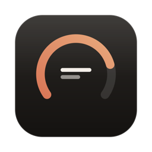
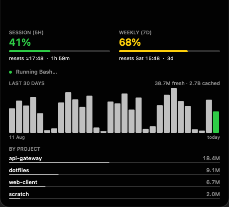

<div align="center">



# ClaudeUsageBar

**See how much of your Claude Code quota is left — without spending any of it.**

A native macOS menu bar app that reads your session (5h) and weekly (7d) usage, plus a
30-day token history rebuilt from Claude Code's own logs. No API key, no telemetry,
no model tokens.




</div>

---

## What it does

A gauge icon sits in your menu bar. The numbers live in an **overlay** that hugs your
MacBook's notch — or hangs below the menu bar as a pill on any other display.

<div align="center">

<br><em>Notch mode — quota on the left of the cut-out, live activity on the right</em>
<br><br>

<br><em>Pill mode — same data, any display</em>
</div>

- **Both quota windows at a glance** — session (5h) and weekly (7d), colour-coded
  independently, with an estimated session reset time.
- **30-day token history** — daily bars and a per-project split, rebuilt from
  `~/.claude/projects/**/*.jsonl`. Hover the overlay to expand it.
- **Live activity (optional)** — the overlay can show what Claude Code is doing right
  now (thinking / running a tool / waiting on you), via a local hook.
- **Quiet by design** — no dock icon, no login prompts, no network call in the normal
  path, and nothing sent anywhere.

> [!NOTE]
> **Screenshots use invented data.** Real projects and token volumes are yours; the
> images above come from `--render-notch --demo`.

## Requirements

- macOS 13 (Ventura) or later
- The **Claude desktop app**, signed in. It writes the usage file this reads.
  (Claude Code alone works only via the fallback path — see
  [Where the numbers come from](#where-the-numbers-come-from).)
- Xcode Command Line Tools, to build: `xcode-select --install`

## Install

No prebuilt binary is published — build it in about ten seconds:

```bash
git clone https://github.com/vinterstudio/ClaudeUsageBar.git
cd ClaudeUsageBar
./build-app.sh
open ClaudeUsageBar.app
```

`build-app.sh` produces a real, double-clickable `ClaudeUsageBar.app` at the repo root.
Drag it to `/Applications` if you like.

**Launch at login:** System Settings → General → Login Items → **+** → pick the app.

<details>
<summary>Optional: a stable signing identity</summary>

```bash
./make-signing-identity.sh
```

Creates a local self-signed certificate (`ClaudeUsageBar Self-Signed`) and signs future
builds with it. This only matters for the fallback OAuth path, where macOS asks for
Keychain access: a stable code identity makes **Always Allow** survive rebuilds. Without
it the app is signed ad-hoc and still works.

</details>

<details>
<summary>Optional: live activity in the overlay</summary>

```bash
./hooks/install-hooks.sh             # merges into ~/.claude/settings.json (backs it up first)
./hooks/install-hooks.sh --uninstall
```

This writes to **your** Claude Code config, which is why it is a script you run rather
than something the app does behind your back. The hook forwards exactly three fields to
a local Unix socket: event name, session id, tool name. **No prompt text, file contents
or tool arguments leave the script**, and nothing is sent off the machine. It exits 0 on
every path — including when the app is not running — so it can never fail one of your
turns.

</details>

## Where the numbers come from

**Primary — a local file, no credentials.**
`~/Library/Application Support/Claude/plan-usage-history.json`. The Claude desktop app
samples its own quota roughly every 15 minutes and keeps a rolling 30-day series
(`fh` = five-hour %, `sd` = seven-day %). Reading it needs no token, makes no network
call, and cannot raise a Keychain prompt.

**Fallback — the OAuth usage endpoint**, used only when that file is absent:

```
GET https://api.anthropic.com/api/oauth/usage
Authorization: Bearer <token from your Keychain>
```

That is a metadata call: no model is invoked and it does not count against your limit.
The app reads the `Claude Code-credentials` Keychain item **read-only** — Claude Code
stays the sole owner and refresher, so the item's access-control list is never reset out
from under either app.

> [!IMPORTANT]
> As of September 2026 the fallback is effectively dead on an up-to-date machine: that
> Keychain item now holds **empty** token strings with `expiresAt: 0`, because Claude
> Code moved its credentials into the Electron *Claude Safe Storage* key. Running
> `claude` rewrites the item but does not repopulate it. The plan-usage file is the
> path that works.

### The session reset time is an estimate

The file carries no reset timestamps, so the session reset is derived: the five-hour
window runs from your first message, which shows up in the series as the most recent
transition from `fh == 0` to `fh > 0`. Measured across 41 windows in a real 30-day
series, the interval from that transition to the next drop clusters at 4.9–5.1h — the
outliers are all sampling gaps (machine asleep), not a different window length.

It is accurate to about the sampling interval, so it is always rendered with a `≈` and
the dropdown states the tolerance. It is suppressed entirely when there is no active
window, when no transition is retained, or when the derived time has already passed — a
missed boundary is better shown as nothing than as a stale time. The **weekly** reset is
not derivable this way, and is not shown.

## The 30-day history

Rebuilt from Claude Code's own transcripts in `~/.claude/projects/**/*.jsonl` — files it
has already written. No API key, no network call, no third-party service.

- **Fresh tokens** (input + output + cache writes) drive the daily bars. Cache reads are
  reported separately and deliberately kept out of the bars: on a real corpus they are
  roughly 98% of the raw count, so including them turns the chart into a picture of
  cache-read volume rather than of work done.
- **By project** splits the window by working directory.
- Turns are deduplicated on `requestId`, so retries and resumed sessions count once.

Scanning is incremental — each file's parsed byte offset is remembered, so a refresh only
decodes bytes appended since the last pass. The first full scan of a ~900MB corpus takes
about 8 seconds on an M2, off the main thread.

## The menu

| Item | What it does |
|------|--------------|
| `Session: 41% used   Weekly: 68% used` | Both windows, spelled out |
| `Session resets ≈17:48 (in 1h 59m)` | Estimated reset + countdown (24h clock) |
| `Last 30d: 38.7M fresh tokens …` | History totals, with cache reads called out separately |
| `Top: api-gateway 18.4M …` | Busiest projects in the window |
| `Sampled 15:48 — from Claude desktop app` | How fresh the quota numbers are |
| **Show in Notch / Show Overlay (pill)** | Toggles the overlay; the label names what this display will get |
| **Install Claude Code Hooks…** | Explains the hook installer and reveals it in Finder |
| **Refresh Now** | Re-read immediately (bypasses any active backoff) |
| **Reveal Raw Response** | Opens the last fallback-path response in Finder |
| **Quit** | Exit |

The menu bar item itself is just the gauge icon, with the figures in its tooltip — it
used to carry the text, which duplicated the overlay and physically collided with it.

## Privacy & security

- **Nothing leaves your machine in the normal path.** The primary source is a local
  file; the history comes from local logs. The only network call that exists at all is
  the fallback metadata endpoint.
- **No telemetry, no analytics, no crash reporting, no third-party services.**
- **No secrets in the repo**, and none in the app — credentials are read from the
  Keychain at runtime and held only in memory.
- **Read-only Keychain access**, via the Security framework, never the `security` CLI.
  The app never writes or refreshes the shared credential item.
- **Hook payloads are treated as untrusted input**: three fields, truncated, stripped of
  control characters, never executed. The socket is mode `0600` in the app's own
  Application Support directory.
- `--doctor` prints credential *state* and, with `--shape`, the credential JSON's
  structure with **every value redacted** — never token material.

## Uninstall

```bash
./hooks/install-hooks.sh --uninstall              # if you installed the hooks
rm -rf /Applications/ClaudeUsageBar.app           # wherever you put it
rm -rf ~/Library/Application\ Support/ClaudeUsageBar
rm -rf ~/Library/Logs/ClaudeUsageBar
defaults delete com.vinterstudio.claudeusagebar   # the "Show in Notch" preference
```

Also remove it from System Settings → General → Login Items if you added it, and delete
the `ClaudeUsageBar Self-Signed` certificate from Keychain Access if you created one.

## Troubleshooting

```bash
swift build -c release
./.build/release/ClaudeUsageBar --doctor
```

Reports which source is in use, credential state (never any token material), whether the
notch is usable, the history totals and the activity socket.

<details>
<summary>"Notch mode is unavailable" on a MacBook that clearly has a notch</summary>

A notched panel offers, for some widths, both a taller mode that extends beside the
notch and a shorter one that sits below it. A mode with no taller sibling (e.g.
1920×1200 on an M2 Air) runs the menu bar *below* the notch, and `safeAreaInsets.top`
reads 0 — the notch is genuinely unaddressable, not absent. The menu names the
resolution to switch to; the overlay falls back to pill mode meanwhile.

</details>

<details>
<summary>Repeated "wants to access key Claude Code-credentials" prompts</summary>

Two causes, both fixed. With an expired token the credential cache was never populated,
so every 5-minute poll performed a fresh secret read; and every rebuild changes the code
identity, invalidating any previous **Always Allow**. The app now compares the item's
modification date first — an attributes-only query that never prompts — and reads the
secret only when something actually changed. On a machine with the plan-usage file the
Keychain is not touched at all.

</details>

<details>
<summary>The numbers look stale</summary>

The menu's last line reports when the *desktop app* last sampled, not when this app last
read the file — the figures are only ever as fresh as that sample (~15 minutes). If the
desktop app is not running, nothing new is being written.

</details>

## Development

```bash
swift build                                   # debug build
swift build -c release && ./build-app.sh      # release + bundle

./.build/release/ClaudeUsageBar --render-notch /tmp          # render with YOUR data
./.build/release/ClaudeUsageBar --render-notch /tmp --demo   # render with invented data
```

`--render-notch` writes the collapsed, expanded and pill PNGs without needing a display,
which is how the overlay is verified in a build step rather than by eye. Use `--demo` for
anything you publish — a default render is a picture of your own projects and volumes.

| Flag | Purpose |
|------|---------|
| `--doctor` | Diagnose source, credentials, notch, history, socket |
| `--doctor --check-credentials` | Also inspect the Keychain item (may prompt) |
| `--doctor --shape` | Print the credential JSON's structure, values redacted |
| `--render-notch <dir> [--demo]` | Render overlay PNGs headlessly |

## License

MIT — see [LICENSE](LICENSE).

---

<div align="center">

Built by [Andreas Vesterlund](https://vinterstudio.com)

<sub>An independent project. Not affiliated with, endorsed by, or supported by Anthropic.
"Claude" is a trademark of Anthropic, PBC.</sub>

</div>
